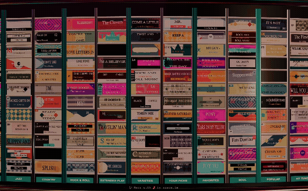

# Juke.sh

3D Spotify jukebox modeled after a chrome-and-neon 50s diner record machine. Three.js scene, full procedural card art, real Spotify integration — your playlists become the records on the drum.

Uses PKCE auth — each user authenticates with their own Spotify account and all API calls go directly from their browser to Spotify (no shared rate limit on a server proxy).

## Setup

1. Create an app at https://developer.spotify.com/dashboard
2. Add redirect URIs (one per environment you'll run on):
   - `https://juke.sh/callback` (juke server)
   - `http://127.0.0.1:3000/callback` (local dev)
3. Copy `.env.local.example` to `.env.local`, fill in `NEXT_PUBLIC_SPOTIFY_CLIENT_ID`
4. `npm install && npm run dev`
5. Visit `http://127.0.0.1:3000` → click **LOGIN WITH SPOTIFY**
6. On the playlist picker, choose one or more playlists to load into the deck

Playback requires an active Spotify device — open Spotify somewhere on your account (desktop app, phone, web player, etc.) so the API has something to send `play` / `pause` / `next` to.

## Routes

- `/` — landing page. Auto-redirects to `/box` if you're already signed in.
- `/box` — the jukebox app. Loads tokens from `localStorage`; if missing, shows just the login button (no full landing graphics).
- `/callback` — OAuth redirect target.

Routes are case-insensitive via middleware (`/BOX`, `/Box`, etc. all 308 → `/box`).

## Controls

- **Tap a card** — play that track on your active Spotify device.
- **Tap an already-playing card** — deselect.
- **Drag left/right** — spin the jukebox. Rotation speed auto-scales with the size of the deck so a 1000-track jukebox doesn't whip past you.
- **Drag up/down** — continuously blend between Roller-Rink (up) and Classic Diner (down) lighting.
- **Scroll wheel / pinch** — continuously zoom between fit-to-screen and tight-on-cards.
- **Double-tap empty chrome** — snap zoom between min and max.
- The currently playing track illuminates with edge LEDs + four tracker LEDs that converge along the top rim from opposite sides so you can always find your way home.

## Caching

- Selected playlists are saved to `localStorage` (`jukebox_selected_playlists`).
- Their assembled track lists are cached for 1 hour, keyed by the sorted set of selected IDs (`jukebox_tracks_cache`).
- The picker modal always shows on refresh with previous picks pre-selected; selecting the same set hits the cache, selecting a different set re-fetches.
- A green `● CACHED` chip appears in the picker next to any playlist whose tracks are currently cached. Click it to flush and re-fetch on next load.

## Notes

- No client secret needed — PKCE auth is browser-only.
- Tokens stored in `localStorage`; access token refresh handled automatically.
- The `NEXT_PUBLIC_` prefix on the client ID means it ships in the JS bundle, which is fine — Spotify client IDs are public; only the secret would be sensitive (and PKCE doesn't use one).
- Spotify-owned algorithmic playlists (IDs starting with `37i9...` — Daily Mix, Discover Weekly, editorial picks) were locked down by Spotify in late 2024 and now return 404 to the Web API. The picker only shows playlists you own or follow, which is the correct accessible set.

## License
PIF