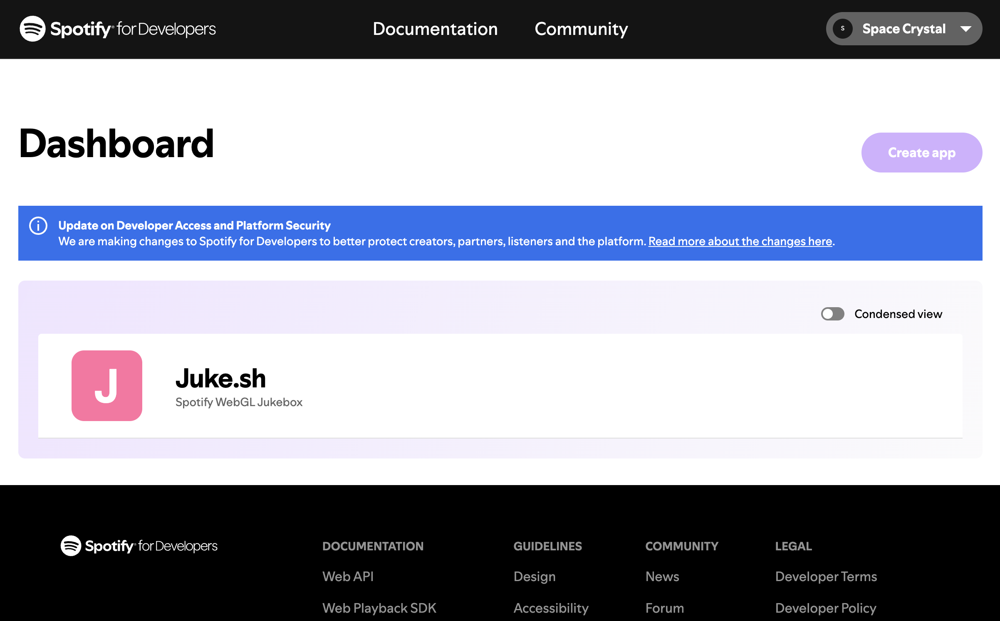
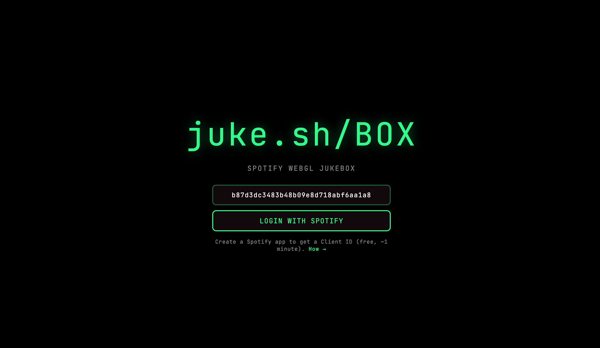
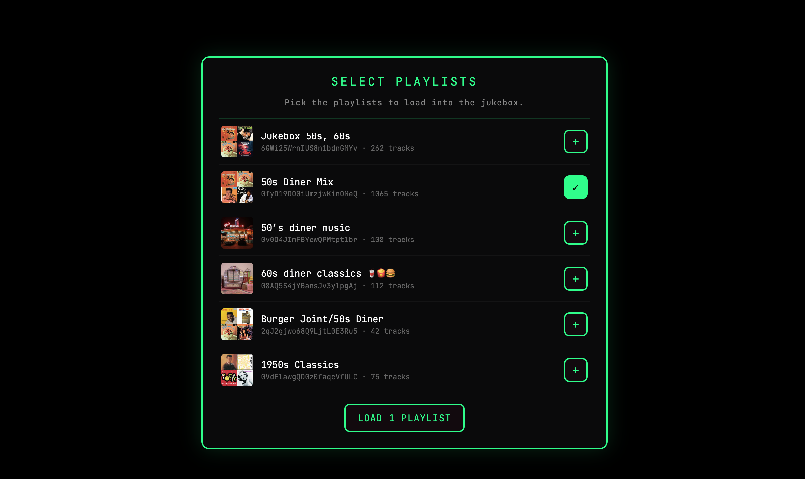
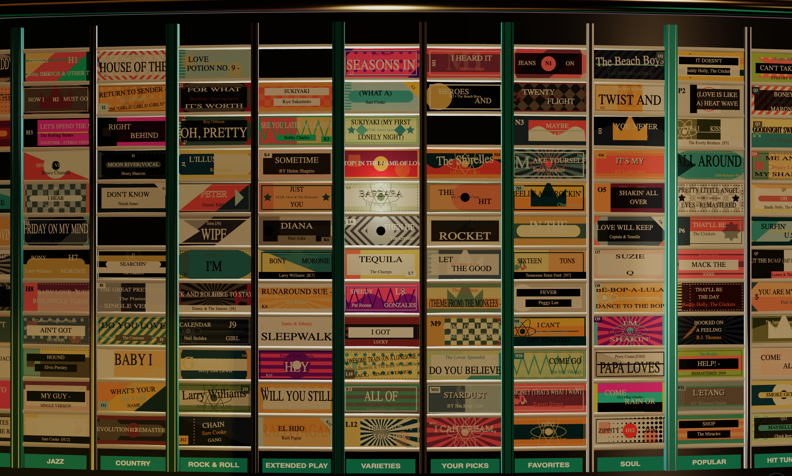
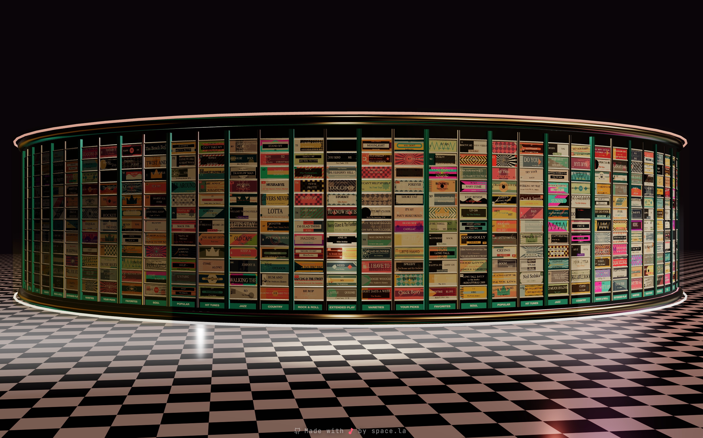

# juke.sh — User Setup Guide

Welcome! This guide walks you through the one-time setup juke.sh needs to connect to your Spotify account. It takes about **2 minutes** and you only have to do it once.

If anything below is unclear, the official Spotify docs are at <https://developer.spotify.com/documentation/web-api>.

---

## Why do I need to do this?

juke.sh plays music from **your own Spotify library and playlists** by talking to Spotify's [Web API](https://developer.spotify.com/documentation/web-api). For Spotify to allow that, every app — including this one — needs a **Client ID**, which is basically a name tag that says "this app is allowed to ask for permission."

Spotify gives Client IDs out for free, but they require you to register your own. juke.sh runs **entirely in your browser** with no server in the middle, so we can't ship a shared Client ID without it getting rate-limited within minutes by everyone using it at once. Giving you your own means:

- **You own the connection.** Spotify sees the calls coming from "your" app, not a stranger's.
- **You get your own rate limit.** Nobody else's usage affects you.
- **You can revoke it any time** from your Spotify account settings.

## Is this secure?

Yes. A Spotify **Client ID** is not a secret — it's a public identifier (you can literally read it in any app's source code). It can't be used to log into your account or read your data on its own.

juke.sh uses an auth flow called **PKCE** (Proof Key for Code Exchange). Here's what that means in plain English:

- We send you to spotify.com to log in.
- Spotify asks **you** if it's OK for juke.sh to access your playlists and playback.
- If you say yes, Spotify sends a one-time code back to your browser.
- Your browser swaps that code for an access token. **No server in the middle ever sees your password, your token, or any private data.**
- The access token is stored only in your browser's `localStorage` (the same place sites save things like dark-mode preferences).

You can revoke juke.sh at any time at <https://www.spotify.com/account/apps/>.

---

## Step 1 — Open the Spotify Developer Dashboard

Go to <https://developer.spotify.com/dashboard> and log in with the **same Spotify account** you listen to music on (the free tier works, but playback control requires Premium).

If this is your first time, Spotify will ask you to accept the developer terms — just click through.



---

## Step 2 — Create a new app

Click the green **"Create app"** button (top right).

Fill in the form:

| Field | What to put |
| --- | --- |
| **App name** | Anything you want — "Jukebox" or "My juke.sh" both work |
| **App description** | Anything ("Personal jukebox app") |
| **Website** | Leave blank, or put `https://juke.sh` |
| **Redirect URI** | `https://juke.sh/callback` &nbsp;— see note below |
| **Which API/SDKs are you planning to use?** | Check **Web API** |

> ⚠️ **The Redirect URI must match exactly** where you'll be using juke.sh:
> - Hosted version: `https://juke.sh/callback`
> - Local dev: `http://127.0.0.1:3000/callback`
> - Self-hosted: `https://YOUR_DOMAIN/callback`
>
> You can add more than one — click **"Add"** after each. If you ever see an "INVALID_CLIENT: Invalid redirect URI" error later, this is what to check.

Check the box agreeing to Spotify's terms and click **"Save"**.

> 📸 **Screenshot needed:** the "Create app" form with example values filled in, with arrows pointing to the **App name** field, the **Redirect URI** field (with `https://juke.sh/callback` typed in), and the **Web API** checkbox.

---

## Step 3 — Copy your Client ID

After saving, you'll land on your new app's dashboard page. Click **"Settings"** (top right).

Near the top you'll see **"Client ID"** — a long string like `7a1b3c5d9e2f4g6h8i0j1k3l5m7n9o1p`. Click the **copy icon** next to it.

> 📸 **Screenshot needed:** the app Settings page with the **Client ID** field highlighted and the copy button circled. **Blur out the actual ID** in the screenshot since it's specific to that example.

> 💡 You'll also see a **"Client secret"** below it. **You don't need it.** juke.sh uses PKCE, which is the modern, secret-less flow — leave the secret hidden.

---

## Step 4 — Paste it into juke.sh

Go to <https://juke.sh> (or wherever you're running it).

You'll see a single input field above the **LOGIN WITH SPOTIFY** button. Paste the Client ID you just copied and click the login button.



You'll be sent to Spotify to log in and grant permission. After approving, you'll land back inside juke.sh, ready to pick playlists.

> 📸 **Screenshot needed:** the Spotify "Agree to terms" / scope-approval screen showing what juke.sh is requesting (playback state, playlists, etc.). This reassures users about what they're agreeing to.

---

## Step 5 — Pick your playlists

The first thing juke.sh shows after login is a **playlist picker**. Click the **+** next to any of your playlists to add them to the jukebox deck, then click **LOAD PLAYLISTS** at the bottom.

You'll see the 3D jukebox build itself with cards for every track. If something is already playing on your Spotify account, juke.sh will spin to that card automatically.





---

## Controls (once you're in)

- **Tap a card** — play that track on your active Spotify device
- **Drag left/right** — spin the jukebox
- **Drag up/down** — shift the lighting between **Roller Rink** (up, moody neon) and **Classic Diner** (down, warm bulbs)
- **Scroll wheel / pinch** — zoom in and out
- **Double-tap empty chrome** — snap zoom between fit-to-screen and tight-on-cards

> ⚠️ Playback requires an active Spotify device. Open Spotify on your phone, desktop, web player, or any other device first so juke.sh has somewhere to send the "play" command. If nothing plays when you tap a card, this is almost always why.




---

## Troubleshooting

**"INVALID_CLIENT: Invalid redirect URI"** when logging in
→ The redirect URI you set in Step 2 doesn't match where you're using juke.sh. Go back to the Spotify Dashboard → your app → Settings → Edit, and add the exact URL (with `/callback` at the end) you're visiting from.

**"server_error" when logging in**
→ Same as above 99% of the time. Double-check the redirect URI matches **exactly**, including `http` vs `https` and trailing slashes (Spotify is strict).

**Cards load but tapping does nothing**
→ No active Spotify device. Open Spotify somewhere (phone, desktop, web) and try again.

**"Some playlists return 0 tracks"**
→ Spotify-owned algorithmic playlists (Daily Mix, Discover Weekly, anything that starts with `37i9...`) were locked down by Spotify in late 2024 and can no longer be read by Web API apps. Only your own playlists and ones you follow will work — that's a Spotify-side restriction, not a juke.sh limitation.

**"I want to use a different Spotify account"**
→ Open browser dev tools → Application tab → Local Storage → clear all `sp_*` keys, then refresh. You'll see the landing page again where you can paste a different Client ID.

---

## Revoking access

You can disconnect juke.sh from your Spotify account at any time:

1. Go to <https://www.spotify.com/account/apps/>
2. Find "juke.sh" (or whatever you named your app)
3. Click **REMOVE ACCESS**

That instantly invalidates the token in your browser. You can re-add it any time by logging in again.

---

```markdown

```
